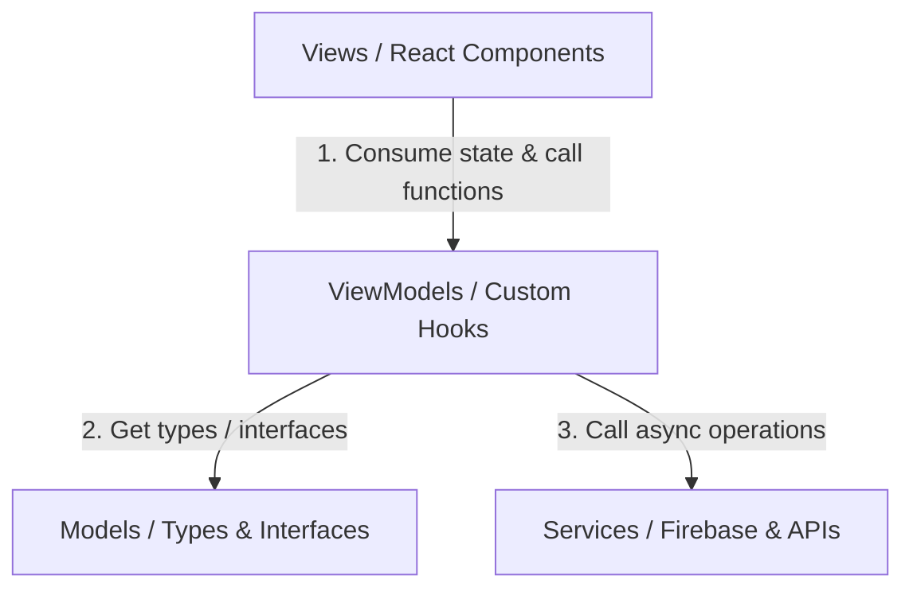

# Quy tắc phát triển dự án (Development Rules)

## 1. Kiến trúc MVVM (MVVM Architecture)
Dự án được cấu trúc chặt chẽ theo mô hình MVVM (Model - View - ViewModel) kết hợp với tầng Services để quản lý các side-effects và tích hợp API/Firebase.

### 1.1. Model (`src/models/`)
- **Vai trò**: Định nghĩa cấu trúc dữ liệu, các interfaces và kiểu dữ liệu (Types/Interfaces) được sử dụng trong hệ thống.
- **Quy tắc**:
  - Không chứa logic xử lý nghiệp vụ (business logic).
  - Không quản lý UI state (trạng thái hiển thị).
  - File Model nên được đặt tên trùng với tên đối tượng (ví dụ: `Food.tsx`, `User.tsx`, `Activity.tsx`).

### 1.2. ViewModel (`src/viewmodels/`)
- **Vai trò**: Chứa logic xử lý nghiệp vụ, quản lý state và các side-effects (`useEffect`), điều phối tương tác với tầng Services.
- **Quy tắc**:
  - Được xây dựng dưới dạng **React Custom Hooks** (ví dụ: `useFoodViewModel()`).
  - Trả về các thuộc tính trạng thái (states) và các hàm xử lý sự kiện (handlers).
  - Không thao tác trực tiếp với DOM hay UI elements.
  - Quản lý trạng thái loading, error và modal/form state liên quan đến view đó.

### 1.3. View (`src/views/`)
- **Vai trò**: Hiển thị giao diện người dùng (UI) và nhận tương tác từ user.
- **Quy tắc**:
  - Viết dưới dạng Functional Components trong React.
  - **TỰ HẠN CHẾ**: Tuyệt đối không gọi trực tiếp các hàm từ tầng Services (như Firebase `db`, `auth`, v.v.) trong View. Mọi hoạt động lấy hoặc gửi dữ liệu phải thông qua ViewModel tương ứng.
  - Tránh viết logic nghiệp vụ phức tạp trực tiếp trong View. View chỉ nhận dữ liệu và kích hoạt các callback từ ViewModel.

### 1.4. Services (`src/services/`)
- **Vai trò**: Nơi tích hợp và cấu hình các thư viện bên thứ 3 (Firebase Auth, Firestore, Storage, Supabase, v.v.).
- **Quy tắc**:
  - Chứa các hàm async để tương tác với cơ sở dữ liệu hoặc API.
  - Không lưu trữ trạng thái của UI.
  - Được gọi chủ yếu bởi các ViewModels.

---

## 2. Quy tắc và Các Lệnh của Hệ Thống (System Rules & Commands)

### 2.1. Sử dụng RTK (Rust Token Killer)
Tất cả các lệnh thực thi qua terminal cần tuân theo cơ chế của RTK để tối ưu hóa tokens.
- **Meta Commands**:
  - Xem thống kê tiết kiệm token: `rtk gain`
  - Xem lịch sử lệnh và lượng token tiết kiệm: `rtk gain --history`
  - Phân tích Claude Code history để tìm cơ hội tối ưu: `rtk discover`
  - Chạy lệnh debug trực tiếp không qua lọc: `rtk proxy <command>`
- **Hook-Based Usage**:
  - Các lệnh thông thường (ví dụ: `git status`, `npm run dev`) được tự động cấu hình chạy qua hook của `rtk` (ví dụ: `rtk git status`), đảm bảo 0 tokens overhead.

### 2.2. Quy tắc Styling & Design System
- **CSS Framework**: Sử dụng **TailwindCSS** kết hợp với các utility classes được định nghĩa sẵn trong `src/index.css`.
- **Component Classes**: Ưu tiên sử dụng các class định nghĩa sẵn thay vì viết ad-hoc Tailwind classes:
  - Button chính: `.btn-primary` (màu xanh lá đầm `#4A7C59`)
  - Button phụ: `.btn-secondary` (màu xanh lá nhạt `#E8F0E9`)
  - Button nguy hiểm: `.btn-danger` (màu đỏ `#EF4444`)
  - Trường nhập liệu: `.input-field`
  - Khung nội dung: `.card`
- **Typography & Colors**:
  - Font chữ: `Inter`, sans-serif.
  - Palette màu: `primary` (theme xanh lá từ 50 đến 900) và `neutral` (màu xám tối giản từ 50 đến 900).
- **Icons**: Sử dụng thư viện `lucide-react` để làm bộ icon chính.

### 2.3. Quy trình phát triển (Implementation Workflow)
1. **Kiểm tra KIs (Knowledge Items)**: Trước khi code hoặc nghiên cứu giải pháp, luôn kiểm tra các file KI trong thư mục `<appDataDir>/knowledge` để tuân thủ các pattern đã có.
2. **Quy tắc Code**:
  - Luôn sử dụng TypeScript chặt chẽ, định nghĩa đầy đủ Type/Interface.
  - Giữ gìn các comment hiện tại và docstrings nếu không liên quan trực tiếp đến chỉnh sửa của mình.
  - Link đến các file hoặc code symbols bằng định dạng markdown của github: `[filename](file:///path/to/file)`.

### 2.4. Ngôn ngữ (Language)
- Giao diện người dùng và thông báo lỗi hiển thị cho user phải viết bằng **Tiếng Việt**.
- Code, tên biến, tên hàm, và các comment kỹ thuật viết bằng **Tiếng Anh**.
